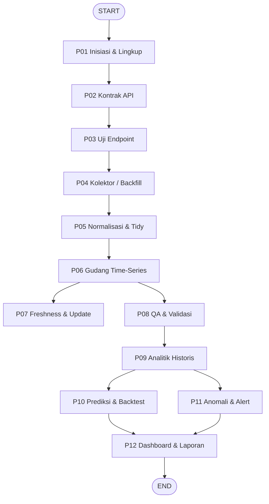

# hargapangan-monitor — Orkestrator

Sistem terintegrasi untuk mengubah endpoint JSON publik **PIHPPS Nasional** (Pusat Informasi Harga Pangan Strategis Nasional) menjadi **big data time-series dinamis** untuk analisis **historis**, **monitoring**, dan **proyeksi**.

## Kapan dipakai

Picu skill ini ketika pengguna meminta:
- mengambil / memonitor harga komoditas bahan pangan dari bi.go.id/hargapangan
- membangun arsip historis harga pangan (big data time-series)
- memastikan data harga selalu up to date
- analisis tren, volatilitas, disparitas antarprovinsi
- prediksi harga pangan + uji backtest
- deteksi anomali / lonjakan harga + alert
- dashboard & laporan monitoring harga pangan

## Prinsip desain

1. **DINAMIS** — semua parameter (komoditas, provinsi, horizon, frekuensi, fitur) dibaca dari `config.yaml` per-proyek. Skill tidak menghardcode lingkup.
2. **SNAPSHOT-DRIVEN** — `GetGridData1` mengembalikan 1 tanggal x 1 komoditas x semua provinsi. Deret waktu dibangun dengan **loop tanggal**.
3. **FRESHNESS-FIRST** — server sendiri yang menandai tanggal rilis terakhir. Setiap run membandingkan tanggal rilis dengan `max(tanggal)` di gudang, lalu menarik hanya yang belum ada.
4. **HIDUP & TUMBUH** — backfill hanyalah titik awal. Update berkala (harian) menjaga data selalu mutakhir. Gudang berperan sebagai pustaka serbaguna: EDA utama, tapi terbuka untuk permintaan ad-hoc apa pun dalam lingkup data.
5. **PROVENANCE** — setiap baris menyimpan `source_url`, `endpoint`, `fetched_at`.
6. **SOPAN** — throttle >= 1,2 detik + jitter, cache, hari kerja saja (weekend fallback ke Jumat).

## Peta alur



## Urutan langkah

| kode | file | aktivitas | output |
|---|---|---|---|
| P01 | `steps/step-01-lingkup.md` | Inisiasi & lingkup (tulis config) | `config.yaml` |
| P02 | `steps/step-02-kontrak-api.md` | Kontrak API (inspect network) | `02_api-contract.md` |
| P03 | `steps/step-03-uji-endpoint.md` | Uji endpoint & parameter | `03_uji-endpoint.csv` |
| P04 | `steps/step-04-kolektor.md` | Kolektor / backfill JSON | `04_raw/*.json`, `manifest.csv` |
| P05 | `steps/step-05-normalisasi.md` | Normalisasi & tidy | `05_tidy/*.parquet` |
| P06 | `steps/step-06-gudang.md` | Gudang time-series + upsert | `warehouse.db`, `log_ingest.csv` |
| P07 | `steps/step-07-freshness.md` | Freshness & update otomatis | `07_freshness.json` |
| P08 | `steps/step-08-qa.md` | QA & validasi | `08_qa-report.csv`, `08_qa.html` |
| P09 | `steps/step-09-analitik.md` | Analitik historis & saat ini | `09_analitik.csv` + chart |
| P10 | `steps/step-10-prediksi.md` | Prediksi & backtest (adaptif) | `10_prediksi.csv`, `10_backtest.csv` |
| P11 | `steps/step-11-anomali.md` | Anomali & alert | `11_alert.csv` |
| P12 | `steps/step-12-dashboard.md` | Dashboard & laporan | `12_dashboard.html`, `12_laporan.md` |

## Aturan eksekusi

1. Jalankan langkah **berurutan** P01 -> P12. Jangan lompat.
2. Baca file `steps/step-NN-*.md` **hanya saat** mencapai langkah itu (progressive loading).
3. Setelah tiap langkah, **verifikasi output** ada dan lengkap sebelum lanjut.
4. Jika langkah gagal (mis. endpoint berubah / data kosong), **hentikan**, laporkan kode langkah + sebabnya, dan tawarkan opsi perbaikan.
5. Setiap visual Mermaid **wajib** disertai file `.html` (render via CDN Mermaid, untuk screenshot manual) + `.mermaid` (sumber).
6. **Etika & batas**: `GetGridData1` adalah API internal situs publik, bukan API resmi ber-SLA. Wajib pakai header browser, throttle >= 1,2 dtk + jeda acak, cache lokal, dan hentikan bila 403/429 berulang.
7. **Provenance**: setiap baris data wajib menyimpan `source_url`, `endpoint`, `fetched_at`.
8. **Freshness**: setiap run update wajib melewati pemeriksaan P07 sebelum menarik data.
9. **Hari kerja saja**: tarik Senin-Jumat. Sabtu/Minggu fallback ke Jumat (flag `is_weekend_fill`).

## Temuan Kunci API (hasil recon)

### Endpoint Utama
- **Base:** `https://www.bi.go.id/hargapangan/WebSite/Home/`
- **Mesin utama:** `GetGridData1` — snapshot 1 tanggal x 1 komoditas x semua provinsi

### Header Wajib (tanpa ini respons KOSONG)
```
User-Agent: Mozilla/5.0 ...
X-Requested-With: XMLHttpRequest
Referer: https://www.bi.go.id/hargapangan
```

### Peta 10 Komoditas (terverifikasi)
| ID | Komoditas | ID | Komoditas |
|---|---|---|---|
| 1 | Beras | 6 | Bawang Putih |
| 2 | Daging Ayam | 7 | Cabai Merah |
| 3 | Daging Sapi | 8 | Cabai Rawit |
| 4 | Telur Ayam | 9 | Minyak Goreng |
| 5 | Bawang Merah | 10 | Gula Pasir |

### Pola Weekend
- 2026: Sabtu/Minggu -> server balas tanggal Jumat terakhir
- 2023: Sabtu/Minggu -> kosong
- **Implikasi:** selalu simpan `tanggal_balas` untuk deduplikasi

### Anomali Provinsi Baru (Kepri ProvID 5)
- `Kelompok=6`, `NilaiDiff=null`, `TanggalLast=null`
- Konsisten di 9/9 komoditas -> tandai `is_provinsi_baru=true`

## Referensi pendukung

- `references/api-contract.md` — kontrak endpoint + header wajib
- `references/skema-tidy.md` — skema long-format + kamus data
- `references/metode-analitik.md` — tren, volatilitas, musiman, disparitas
- `references/metode-prediksi.md` — baseline adaptif, backtest, metrik error
- `references/template-output.md` — template tiap output

## Skrip pendukung

- `scripts/harvest_hargapangan.py` — kolektor + freshness probe + throttle + cache
- `scripts/normalize_tidy.py` — JSON -> long-format (parquet/csv)
- `scripts/build_warehouse.py` — SQLite, upsert + dedup + log revisi
- `scripts/check_freshness.py` — probe tanggal rilis & bandingkan gudang
- `scripts/qa_validate.py` — gap, missing, outlier, duplikat
- `scripts/forecast.py` — baseline adaptif + backtest (bekerja dengan data pendek)
- `scripts/render_dashboard.py` — HTML + Chart.js + Mermaid
- `scripts/render_mermaid.py` — `.mermaid` + `.html` (screenshot manual)

## Lokasi penyimpanan

**Skill (definisi):** `C:\Users\mawwa\OneDrive\myFolder\mine\AI skills\hargapangan-monitor\`

**Output proyek (dinamis):** `<output_root>\<nama-proyek>\` dengan `<output_root>` diambil dari `config.yaml` (default: `...\AI skills\hargapangan-monitor\output`):

```
<output_root>/<nama-proyek>/
├── 01_backfill/    <- P04 (raw JSON)
├── 02_data/        <- P05, P06 (tidy + warehouse.db)
├── 03_analitik/    <- P07, P08, P09, P10, P11
├── 04_laporan/     <- P12
└── log/            <- jejak eksekusi
```