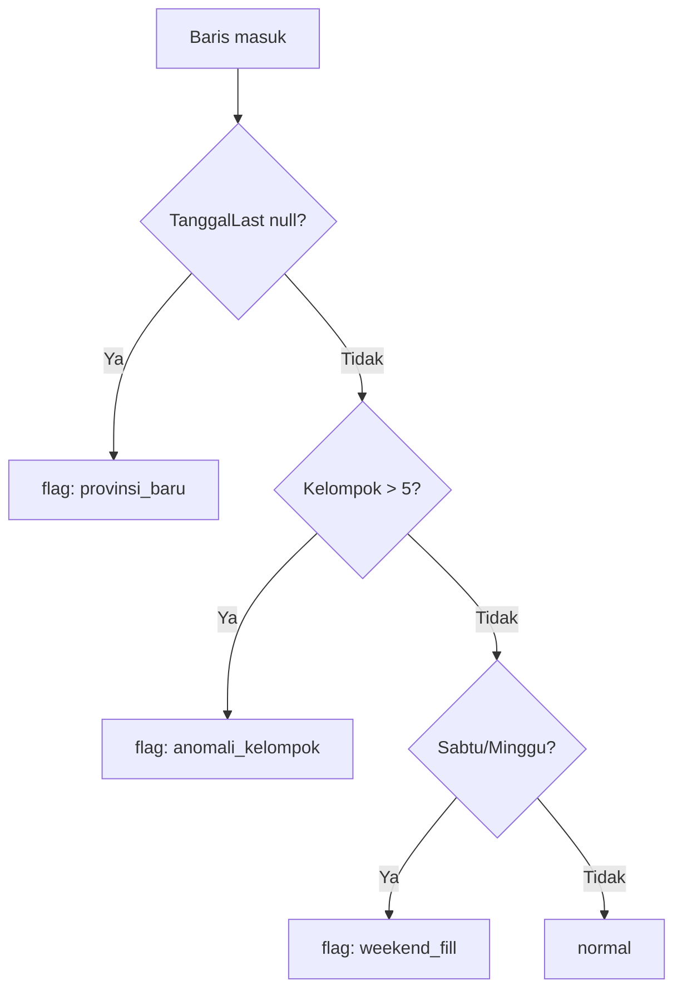

# Skema Tidy — Long Format

Semua data mentah JSON dinormalisasi ke **satu tabel panjang** yang identik kolomnya.

## Tabel `fakta_harga`

| kolom | tipe | sumber | catatan |
|---|---|---|---|
| `tanggal_diminta` | date | input loop | tanggal yang kita minta |
| **`tanggal`** | date | `Tanggal` respons | **tanggal data sesungguhnya** |
| `commodity_id` | int | parameter | 1–10 |
| `nama_komoditas` | str | `Komoditas` | |
| `prov_id` | int | `ProvID` | |
| `nama_provinsi` | str | `Provinsi` | |
| `price_type_id` | int | parameter | 1–4 |
| `nilai` | float | `Nilai` | Rp |
| `nilai_diff` | float | `NilaiDiff` | parse `Rp100` → `100.0` |
| `nasional` | float | `SemuaProvinsi` | dihitung server |
| `kelompok` | int | `Kelompok` | **bisa 6** (anomali Kepri) |
| `stddev` | float | `stdDev` | dihitung server |
| `percentage` | float | `Percentage` | |
| `tanggal_last` | date | `TanggalLast` | **null bila provinsi baru** |
| `is_provinsi_baru` | bool | derivasi | **true bila `TanggalLast` null** |
| `is_weekend_fill` | bool | derivasi | true bila diisi dari Jumat |
| `source_url` | str | dibangun | provenance |
| `fetched_at` | datetime | waktu panen | ISO-8601 UTC |

## Primary Key Gabungan

```
(tanggal, commodity_id, prov_id, price_type_id)
```

Menjamin upsert idempoten.

## Aturan Parsing

1. **Tanggal** `18 Sep 26` → `2026-09-18`. Peta bulan: Jan..Des.
2. **NilaiDiff** `Rp0` / `Rp100` / `-Rp150` → float. Hapus `Rp`, koma ribuan.
3. **Nilai** bisa string `"13900.00"` → float.
4. **null** pada `stdDevPercentage` dibiarkan null.
5. Semua baris **wajib** punya `source_url`, `endpoint`, `fetched_at`.

## Tiga Flag QA Otomatis



## Tabel Dimensi

### `dim_komoditas`
| commodity_id | nama |
|---|---|
| 1 | Beras |
| 2 | Daging Ayam |
| 3 | Daging Sapi |
| 4 | Telur Ayam |
| 5 | Bawang Merah |
| 6 | Bawang Putih |
| 7 | Cabai Merah |
| 8 | Cabai Rawit |
| 9 | Minyak Goreng |
| 10 | Gula Pasir |

### `dim_wilayah`
| prov_id | nama_provinsi |
|---|---|
| 1–34 | (dari `GetProvinceAll`) |

### `dim_tipe_harga`
| price_type_id | nama |
|---|---|
| 1 | Pasar Tradisional |
| 2 | Pasar Modern |
| 3 | Pedagang Besar |
| 4 | Produsen |

## View Turunan

- `v_timeseries` — `SELECT tanggal, commodity_id, prov_id, nilai FROM fakta_harga ORDER BY 1`
- `v_nasional` — agregat harian per komoditas (rata-rata semua provinsi)
- `v_disparitas` — `MAX(nilai)/MIN(nilai)` per tanggal-komoditas

## Format Simpan

- `05_tidy/<proyek>.parquet` (utama, hemat)
- `05_tidy/<proyek>.csv` (inspeksi manual)